# Diagram catalog

Pick by **the question currently on the table**. If no question is open, no diagram is
needed.

| The question | Diagram | § |
|---|---|---|
| What are we building, who uses it, where does it stop? | System context (C4 L1) | 1 |
| What runs, and what talks to what? | Container (C4 L2) | 2 |
| Where does this new code go? | Component (C4 L3) | 3 |
| How do these few types relate? | Code (C4 L4) | 4 |
| What's the whole solution, infra included? | System architecture | 5 |
| In what order, and who calls whom? | Sequence | 6 |
| What states are legal, and which are not? | State machine | 7 |
| What do we store, and what owns it? | Entity-relationship | 8 |
| Where does untrusted input enter and get checked? | Data flow + trust boundaries | 9 |
| What fails together? Where's the latency? | Deployment | 10 |
| What may import what? | Dependency graph | 11 |
| How many steps does the user actually take? | User flow | 12 |
| Which approach do we pick? | Option comparison | 13 |
| What ships first, what blocks what? | Phasing | 14 |

**On Mermaid's C4 support:** `C4Context` / `C4Container` blocks exist but are still
experimental and render inconsistently across viewers. Use `flowchart` with C4
conventions instead — person, system, external system, styled by `classDef`. Same
information, renders everywhere.

---

## 1. System context

**Q:** What is this system, who uses it, what does it depend on — and what is *not* ours?
**Draw when:** starting anything new, or when scope is being argued.
**Skip when:** adding a feature inside a system whose boundary is already settled.

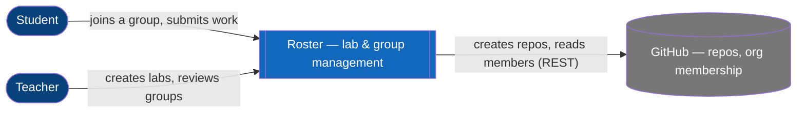

**Wrong-diagram tell:** you're drawing boxes that live *inside* your system. That's §2.

## 2. Container

**Q:** What separately-runnable pieces exist, and over what protocol do they talk?
**Draw when:** almost always. The highest value-per-minute diagram there is.
**Skip when:** single process, single binary, no datastore.

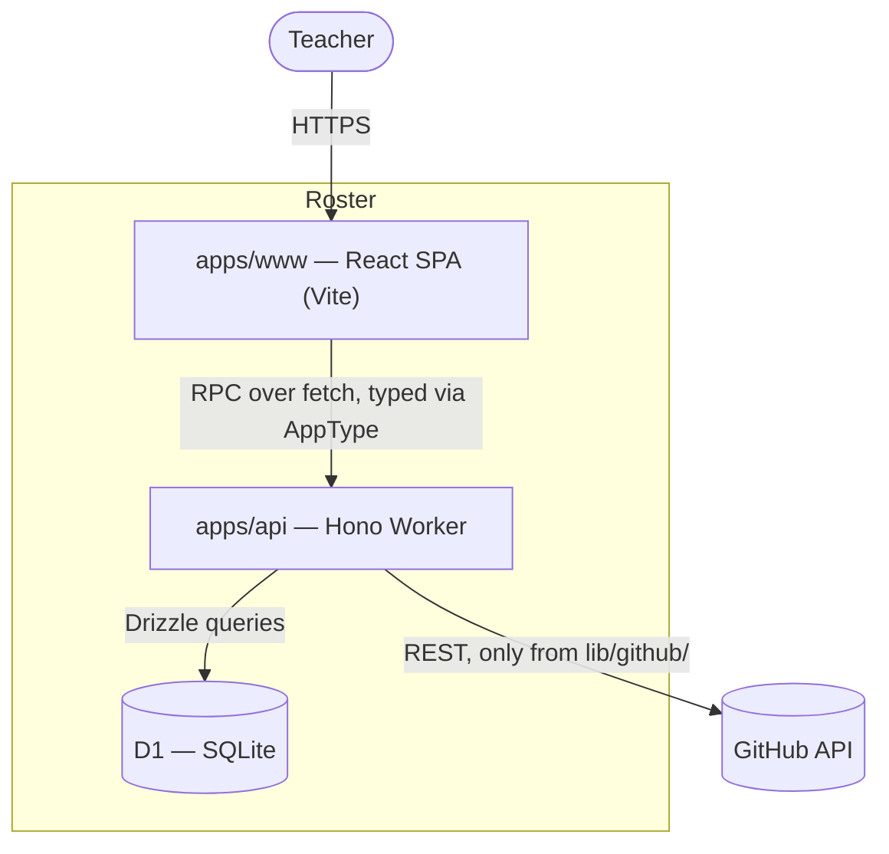

**Wrong-diagram tell:** two boxes that always deploy together and share a process —
they're components, not containers. That's §3.

## 3. Component

**Q:** Inside one container, what are the major parts and where does new code go?
**Draw when:** a container is growing, or a placement convention is being decided.
**Skip when:** the container has one obvious module.

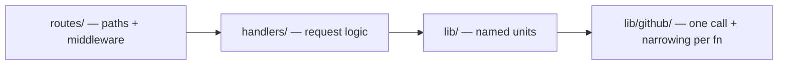

**Wrong-diagram tell:** you're naming functions. That's §4, and it's usually not worth
drawing.

## 4. Code

**Q:** How do these specific types relate?
**Draw when:** a genuinely intricate relationship — a variance problem, a state-carrying
hierarchy. Rare.
**Skip when:** almost always. The IDE generates this on demand and it goes stale fastest.

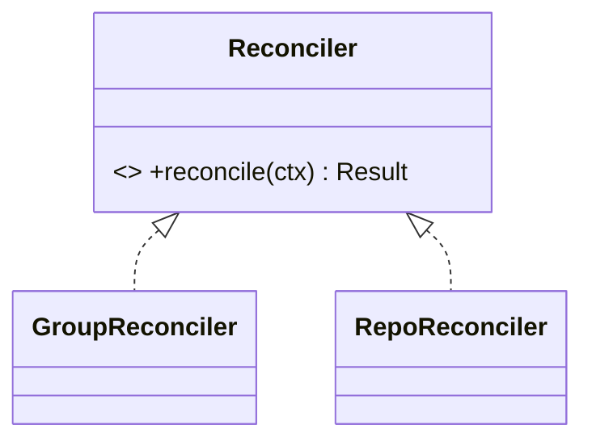

## 5. System architecture

**Q:** What does the whole solution look like, cloud services and all?
**Draw when:** infrastructure is part of the design — queues, CDNs, buckets, auth
providers, schedulers.
**Skip when:** it would be §2 with logos on it. Only draw this if infra choices are
genuinely under discussion.

Same form as §2, plus the managed services and the edges to them, grouped by provider
or by environment.

**Wrong-diagram tell:** every box is a vendor logo and no arrow says what flows. Label
the edges or delete the diagram.

## 6. Sequence

**Q:** In what order does this happen, who calls whom, and where can it fail midway?
**Draw when:** ordering *is* the design — auth flows, webhooks, retries, multi-step
writes, anything with a partial-failure window.
**Skip when:** one call, one response.

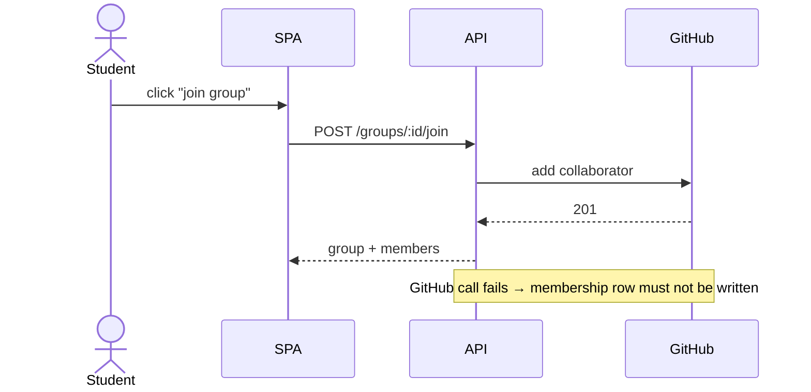

Put the failure note in. The happy path was never the reason to draw this.

## 7. State machine

**Q:** What states can this entity be in, what transitions are legal, and what's
unreachable?
**Draw when:** anything with a lifecycle — invitations, jobs, submissions, subscriptions.
Very high value, very under-drawn.
**Skip when:** the thing has two states and one transition.

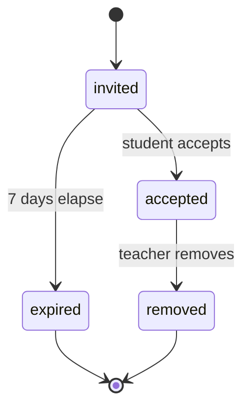

**Payoff:** this is what stops `isLoading` and `isError` both being true. If the diagram
has one state per boolean combination, the state should be one field, not N booleans.

## 8. Entity-relationship

**Q:** What do we store, what owns what, and what does the cardinality actually mean?
**Draw when:** new tables, or a relationship anyone had to ask about twice.
**Skip when:** adding a column.

```mermaid
erDiagram
    CLASS ||--o{ LAB : contains
    LAB ||--o{ GROUP : has
    GROUP }o--o{ USER : "membership"
```

Say the cardinality out loud while drawing — "a group has many users, a user is in many
groups" — that sentence is where the wrong assumption surfaces.

## 9. Data flow with trust boundaries

**Q:** Where does untrusted data enter, where is it validated, and what crosses a
boundary unchecked?
**Draw when:** user input, third-party payloads, webhooks, file uploads, anything
security-relevant. **This doubles as the threat model.**
**Skip when:** all data originates inside the system.

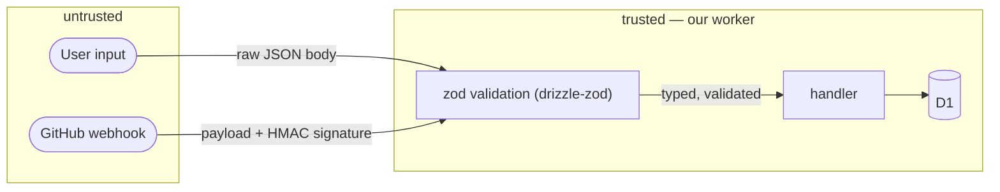

**Wrong-diagram tell:** no boundary drawn. Then it's §2 with different words — the
boundary is the entire point.

## 10. Deployment

**Q:** What runs where, what fails together, and where does the latency come from?
**Draw when:** multiple environments, regions, or availability requirements.
**Skip when:** one region, one platform, no ops question open.

Nodes as `subgraph`s (region / edge / origin), containers inside them, edges labeled
with protocol *and* rough latency where it matters.

## 11. Dependency graph

**Q:** What may import what?
**Draw when:** setting or defending layering rules. Its output becomes a
`project-conventions` rule directly.
**Skip when:** two modules.

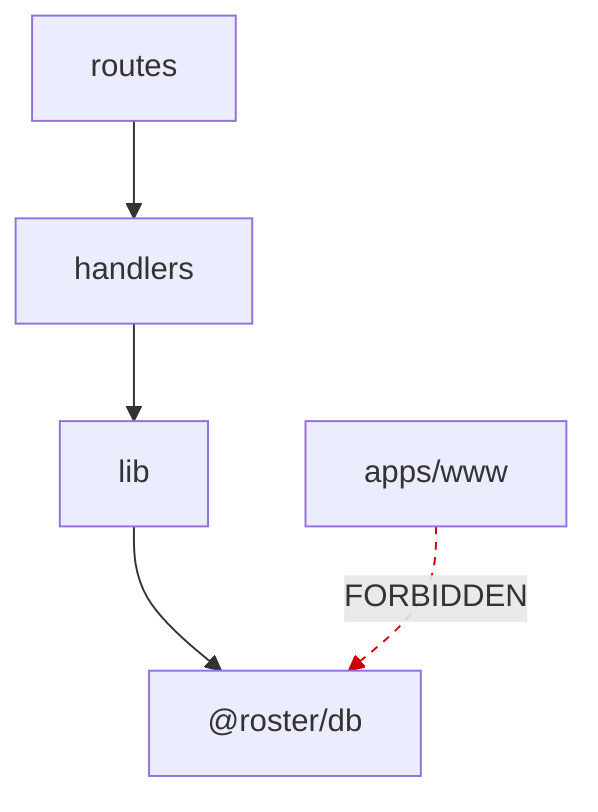

Draw the **forbidden** edges too, marked. A dependency diagram showing only what's
allowed doesn't say what it's protecting against.

## 12. User flow

**Q:** How many steps, decisions, and dead ends does the user actually face?
**Draw when:** a multi-screen flow, or when the product shape is what's disputed.
**Skip when:** one screen.

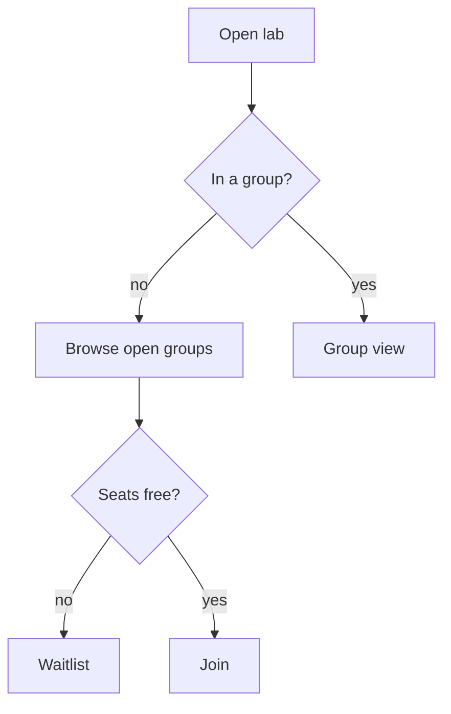

Often settles a design argument faster than any architecture diagram, because it's the
only one the non-engineers in the room can check.

## 13. Option comparison

**Q:** Which of these approaches?
**Draw when:** the options differ *structurally*. Two small diagrams side by side beat
two paragraphs.
**Skip when:** they differ only in a library choice — that's a sentence.

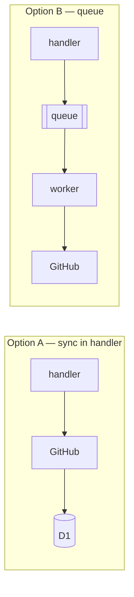

State the deciding trade-off under it in one line — not a feature matrix.

## 14. Phasing

**Q:** What ships first, and what blocks what?
**Draw when:** the plan has 4+ phases or a real dependency order.
**Skip when:** three sequential steps — a numbered list is clearer.

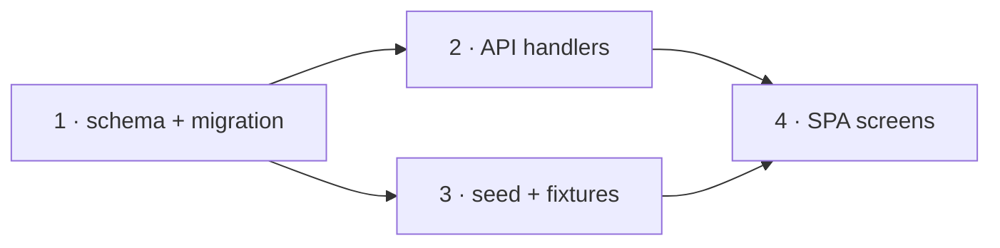

Put the riskiest unknown in phase 1. If it's late in the graph, the graph is wrong.
