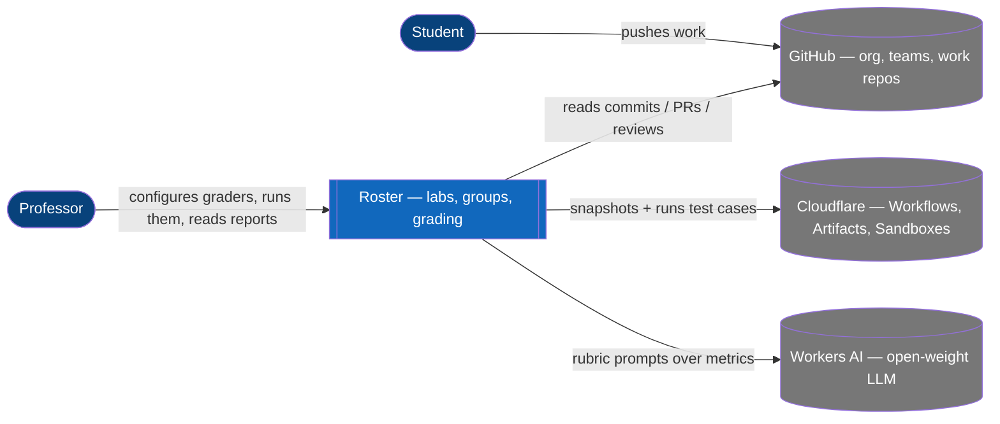
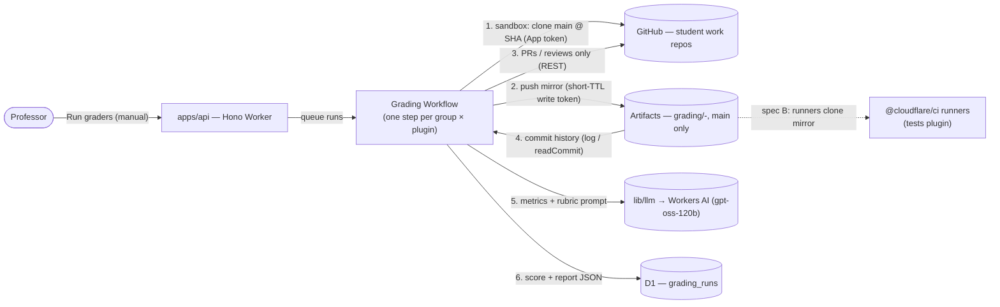
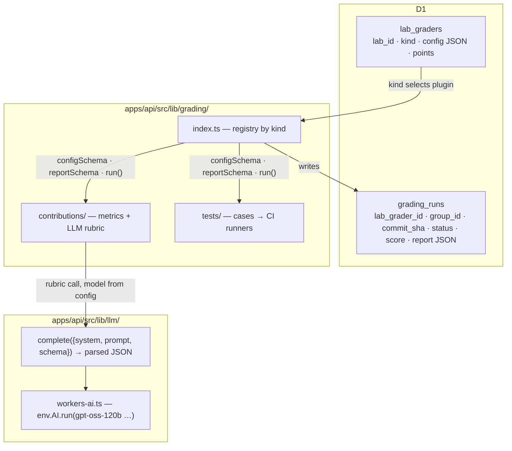

# Roster Autograding — design board

Working board for the autograding design discussion (2026-08-17). **Spec written → `docs/specs/2026-08-17-autograding.md`** (2026-08-17, from decisions 1–12); this board stays as the record of the discussion.

## Decisions so far

| # | Decision | Status |
|---|----------|--------|
| 1 | Prof-facing, manual trigger (no push-triggered grading) | ✅ agreed |
| 2 | Snapshot = last student commit on `main` ≤ deadline; **no override, no picker** in the UI (mockup review 2026-08-17) | ✅ agreed |
| 3 | Build order: core + contributions plugin first, tests plugin second | ✅ agreed |
| 4 | Two specs: **A** core (incl. Artifacts mirror) + contributions · **B** tests on CI SDK runners over the mirror | proposed |
| 5 | **Snapshot = a Cloudflare Artifacts repo per group, mirror of `main` only**, made by the core at run start (main cut at the deadline SHA per #2); all graders read the mirror; other branches are not graded. Artifacts is therefore a **core dependency (spec A)**, not spec-B-only. Until beta access lands: SHA pointer stored, mirror step no-op behind a flag | ✅ agreed 2026-08-17 |
| 6 | Anthropic/Claude inference **dropped for now** — to be discussed later; if revisited, path is Anthropic SDK → CF AI Gateway | ⏸ deferred 2026-08-17 |
| 7 | LLM = **Cloudflare Workers AI open-weight models only** (`gpt-oss-120b` to start), behind a small `lib/llm/` port so the model is config; model id + prompt version pinned into each run's report | ✅ agreed 2026-08-17 |
| 8 | Late penalty is **not** a grader — already covered by the app (last push vs deadline) | ✅ agreed 2026-08-17 |
| 9 | **UI = a Grading tab of the lab** (`…/manage/grading`, sibling of Groups via a tab strip under `LabHeader`): stats strip · grader cards · toolbar · groups × graders score table · report drill-down. Variant B (grades folded into the group wall) reviewed and dropped. Mockups: `docs/design/mockups/2026-08-17-lab-grading.mockup.html`, `…/2026-08-17-grader-config.mockup.html`; design language `docs/design/design-language.md` | ✅ agreed 2026-08-17 |
| 10 | **Tests plugin = one command, not a test-case system** (team lead, 2026-08-17; confirmed by the TWeb repos: `classroom.yml` = one `autograding-command-grader` step, `setup-command: npm install`, `command: npm run test`, tests in the template's `test/`): setup command + one command run in a Cloudflare sandbox on the mirrored `main`; pass = exit 0, output captured; prefilled from the starter code's `classroom.yml` when present. No case editor in the UI ("too much, users will avoid it"). Per-test credit via JUnit/TAP parsing = later, off by default | ✅ agreed 2026-08-17 |
| 11 | **Simplicity pass** (2026-08-17): no points, no weights, no totals. Tests = **pass / fail** (Classroom's only signal); Contributions = **n / 8**, each dimension 0–2, on/off only. One grader per kind, fixed order (Tests, Contributions), no name/position/points fields. Grader list instead of a card wall; toolbar = search + "failed only" + Run everything; stats = graded · tests passing · failed runs. Report shows the two verdicts, no total | ✅ agreed 2026-08-17 |
| 12 | **Tests config lives in the starter code: `roster.yml`** at the repo root (`tests: {setup, command, timeout}`), read from the **template** repo's `main` at run time (never the student copy); fallback to `.github/workflows/classroom.yml` so existing TWeb templates work unchanged. UI shows the parsed file + Environment only. Contributions stays UI-configured | ✅ agreed 2026-08-17 |
| 13 | **Tests verdict = passing / total tests** when the runner summary is readable (regex table, no LLM; JUnit XML later), else pass / fail. The starter code's test suite is the scale — no points to configure | ✅ agreed 2026-08-17 |

## Resume on another device

Branch `brainstorm/autograding`. Everything needed is in the repo: this board, the spec, the design language, the mockups, the two skills (`.claude/skills/architecture-brainstorming`, `.claude/skills/frontend-design`) and the viewer (`.claude/tools/aiview`, Node ≥ 22.5, no install; vendor libs are fetched on first run). The viewer's index is per machine, so re-register once from the repo root:

```sh
A="node .claude/tools/aiview/aiview.mjs"
$A add docs/specs/2026-08-17-autograding.brainstorm.md --tag roster --tag autograding --started 2026-08-17T14:15:00+02:00
$A add docs/specs/2026-08-17-autograding.md --kind spec --tag roster --tag autograding --started 2026-08-17T16:15:00+02:00
$A add docs/design/design-language.md --kind reference --tag roster --tag design --started 2026-08-17T15:16:00+02:00
$A add docs/design/mockups/2026-08-17-lab-grading.mockup.html --tag roster --tag autograding --started 2026-08-17T15:21:00+02:00
$A add docs/design/mockups/2026-08-17-grader-config.mockup.html --tag roster --tag autograding --started 2026-08-17T15:31:00+02:00
$A add docs/design/mockups/2026-08-17-grading-report.mockup.html --tag roster --tag autograding --started 2026-08-17T15:43:00+02:00
$A serve docs/specs/2026-08-17-autograding.md --open
```

Where we stopped (2026-08-17 evening): spec written and under review; next step = the phased plan (riskiest first: sandbox clone + `npm run test` on a TWeb repo), then implementation. Team lead review of the mockups pending (tomorrow).

## Context we are building on

### From the `grader` skill (prof's existing Claude Code grading skill)
- **Criterion source types**: `automated` (a tool runs, score derived from output, no judgment) · `manual` (AI analyses deliverables — code, git history, manifests — and judges) · `live` (runtime checks by the prof). Combinations allowed. Our tests plugin = `automated`; contributions plugin = `manual`.
- **Git & workflow practices [C]** dimensions — *single-student baseline*: work spread over time (not all in the last hours before deadline); descriptive commit messages. ("Meaningful history / not one dump" dropped 2026-08-17 — covered by spread over time.) *Multi-student additions* (only when >1 author): balanced contribution across members; use of branches and PRs; DevOps practices (CI, protected branches, PR reviews — only what was taught). Depth is negotiated with the prof → becomes the plugin's config form.
- ~~Late penalty~~ — **out of scope**: the app already tracks last push vs deadline (status chips on the lab groups page); lateness is not a grader concern.
- Posture: per-group analysis, scoring table, prof confirms everything. Same here: **prof-facing, advisory, manual trigger.**

### GitHub Classroom autograding (the reference)
Tests are configured in the assignment UI (name, points, timeout, type): **Input/Output** and **Run command** (pass = exit 0). Classroom writes `.github/workflows/classroom.yml` into the template repo; each student push runs it on Actions. Students can see/tamper the workflow. **We keep only the run-command idea** (one command, exit code) — which is all TWeb ever used — executed by us in a sandbox on the mirror; not the I/O case editor, not push-triggered, not student-visible.

*Checked on the Classroom side (2026-08-17, `gh classroom` + `gh api`, classroom HEIGVD-WEB-26 web-a, assignment "2 - Tetris I"):* the autograding config exists **only** as the workflow file in the starter repo — `autograding-command-grader@v1` inputs are `test-name`, `setup-command`, `command`, `timeout` (min, default 10), `max-score` (optional). The Classroom API/CSV stores per accepted assignment just `passing: true|false`, `commit_count`, `submitted`, `grade` (null unless set), and the grades CSV `points_awarded / points_available` — TWeb never set `max-score`, so it's 0/0 and the only signal is **passing** (10 of 11 groups). Feedback PRs enabled. So our v1 (one command → pass/fail → points) is exactly Classroom's effective model, plus the report and the mirror.

## Core design (spec A)

### Data
- `lab_graders` — lab_id · kind (`'tests' | 'contributions' | …`, the plugin axis; **one row per kind per lab**) · config JSON (validated by the plugin's zod schema) · enabled. No points/position (decision #11); display order is fixed by the registry.
- `grading_runs` — lab_grader_id · group_id · **commit_sha** (the graded snapshot) · status `queued|running|done|failed` · **verdict** (plugin-shaped scalar: tests `pass|fail`, contributions `0–8`) · report JSON (plugin-shaped) · error · triggered_by · timestamps
- Adding a plugin = new enum value + new folder; **no new tables** (extend the existing axis, mirrors `lib/reconcile/` registry).

### Plugin contract — `apps/api/src/lib/grading/<kind>/`
```ts
{ kind, configSchema, reportSchema,
  run(ctx: { group, repo, sha, config, github, llm, sandbox? }) → { score, max, report } }
```
Registry in `lib/grading/index.ts`; handlers orchestrate ("run grader X on lab Y for groups […]"), never touch GitHub/LLM directly (rule 7).

### Snapshot rule
Vocabulary: a **SHA** is a commit id — it pins one exact repo state forever; the **snapshot** is the repo state we graded.
At run start, per group: resolve the SHA = last student commit on `main` ≤ deadline (no override; the UI only states it) → **mirror `main` up to that SHA into the group's Artifacts repo** (`grading/<lab-slug>-<group-slug>`) → store SHA + mirror ref on the run. Every plugin reads the mirror; branches other than `main` are not graded.
Mirroring mechanics: Artifacts `import` only takes public remotes and student repos are private → a sandbox step clones GitHub `main` with the App installation token and pushes to the Artifacts repo using a short-TTL write token minted for the run. Re-runs re-push (same repo, new commit if HEAD moved) so history of graded states is kept in the mirror.
Why a copy and not just a pointer: students keep control of the GitHub repo after the deadline (force-push, delete); the mirror is immutable, ours, EU-localizable, and forkable for hidden-test overlays.
**Dependency:** Artifacts is closed beta and the HES-SO account is gated (error 10004) → **beta request to submit** (form: https://forms.gle/DwBoPRa3CWQ8ajFp7). Until then the core stores the SHA and the mirror step is a no-op behind a flag; nothing else is blocked.

### Orchestration
Prof clicks Run → handler inserts queued `grading_runs` → **Cloudflare Workflow** (durable, retries, one step per group) executes → UI polls status. Raw logs/stdout to R2 if too big for D1.

### UI (mockups approved 2026-08-17 — see decision #9)
Lab page gets a tab strip **Groups | Grading** under `LabHeader`; `/manage/grading` = `LabStats` (graded/total · failed · avg score · never run) → **Graders** wall (one card per attached grader: points, summary, last run, Configure / Run all; `Add grader ▾` from the plugin registry) → toolbar (search · all/attention/failed dimming segments · caption "graded from main at the deadline" · **Run everything**) → **score table** (row per group: SHA link, one column per grader with /max, Total, last run, Report › / Re-run) → advisory footnote. States: empty (no graders yet), running (progress line + Stop, queued/running chips), error. Grader configuration = one shared `GraderDialog` shell (Name · Points · Position · Remove) with plugin-owned form bodies: contributions = dimensions with switch + equal-by-default weights (InputGroup "pts"), model (Workers AI), evidence sample, extra guidance; tests = command, setup command, timeout, environment, points, prefilled from the starter code's `classroom.yml`, Dry run on a repo. Each plugin also ships its report view (`docs/design/mockups/2026-08-17-grading-report.mockup.html`).

## Plugin: contributions (spec A)
1. **Deterministic metrics** (no LLM): commits & LOC per author, timeline buckets vs deadline, % of work in last 24/48 h, bus factor, message-length stats — computed **from the mirror** (`main` history via the Artifacts binding `log()`/`readCommit()`/`readTree()`, or `git log` in the sandbox). PR / review / branch counts are the one GitHub-only input (they don't live in `main`'s history) → `lib/github/`. Stored as data the prof can trust.
2. **LLM assessment** over the metrics + a sample of commit messages/diffs, one prompt per dimension set (baseline; multi-author extras only when >1 author). Output per dimension: score · confidence · rationale · evidence pointers (SHAs). Advisory. Model + prompt version pinned into the report.
- Config: which dimensions are on (each 0–2, no weights) + optional extra guidance; model under Advanced.

## Plugin: tests (spec B) — a command, not test cases
- Reference: TWeb repos (`C:/HEIGVD/TWEB26/lab-solutions/2-tetris-i`): unit tests (mocha/chai) live in the template's `test/`; `.github/workflows/classroom.yml` runs ONE `autograding-command-grader` step — `setup-command: npm install`, `command: npm run test`, `timeout: 10`. Students inherit tests + workflow.
- Config: **`roster.yml` in the starter code** (root):
  ```yaml
  tests:
    setup: npm install     # optional, cached on lockfile hash
    command: npm run test  # exit 0 = pass
    timeout: 10            # minutes
  ```
  Read from the template repo's `main` at run time (students can't change how they are graded); if absent, parsed from `.github/workflows/classroom.yml`. The UI only adds the sandbox environment. Later keys can hold other lab-level config.
- Run: mirror `main` @ deadline SHA (Artifacts) → sandbox: setup → command → capture exit code, stdout/stderr (capped), duration. verdict = **passing / total** read from the runner's summary (mocha `17 passing / 2 failing`, jest, pytest, node --test, JUnit) — else **pass / fail** from the exit code. Report shows the output.
- Later, opt-in: parse JUnit XML / TAP (or a recognisable runner summary) → per-test rows and proportional points. Not in v1.
- Substrate: Cloudflare **Sandbox** (execution) + **Artifacts** (mirror) — both needed. Options considered earlier (Actions in a private repo; Classroom-style workflow in the student repo) dropped.

## Later plugins (same contract)
Hidden tests (prof-uploaded tests injected before run) · LLM code review against criteria · CSV export of the whole grid.

## System context



## Grading run — container view (snapshot resolved)



**Resolved (decision #5):** the core mirrors `main` @ deadline SHA into an Artifacts repo per group; every grader reads the mirror. Contributions still hits GitHub for PRs/reviews only.

## Plugin shape (draft, for reference)



## LLM access — research notes

- **Workers AI open-weight catalog** (native `env.AI.run`, CF-billed, free 10k neurons/day then $0.011/1k): `gpt-oss-120b` (0.35/0.75 $/M in·out), `nemotron-3-120b` (0.50/1.50), `deepseek-v4-pro` (1.32/3.96), `kimi-k2.7-code` (0.95/4.00, 262k ctx), `qwen3-30b-a3b` (0.05/0.34), `llama-4-scout` (0.27/0.85), `mistral-small-3.1-24b` (0.35/0.56). Function calling / structured output on the reasoning ones. Claude Opus 5 = 5/25, Sonnet 5 = 3/15 for comparison.

- *(deferred)* Claude is reachable through CF AI Gateway (`…/v1/{account}/{gateway}/anthropic`, BYOK or unified billing, official SDK with `baseURL`) — parked for a later discussion.

## Cloudflare Artifacts — research notes

- Git-compatible versioned storage; repo per unit of work; Workers binding + REST + git protocol; repo-scoped read/write tokens; fork; EU data localization (2026-08-13).
- **Closed beta, Workers Paid only.** HES-SO account currently gated (`wrangler artifacts namespaces list` → error 10004). Request form exists.
- `import` accepts **public** HTTPS remotes only → private student repos get mirrored by a sandbox push using the GitHub App token.
- **CI on push:** `cf.artifacts.repo.pushed` → Workflow → `@cloudflare/ci` `runner({name, command, cache})`: one isolated sandbox per command, logs/status/output captured, dependency-cache snapshots in R2, runners fork from a cached install. Needs Containers + Workflows + R2 + Artifacts bindings.
- Value for grading: immutable, forkable, EU-localized graded snapshot per group that survives post-deadline force-pushes.
