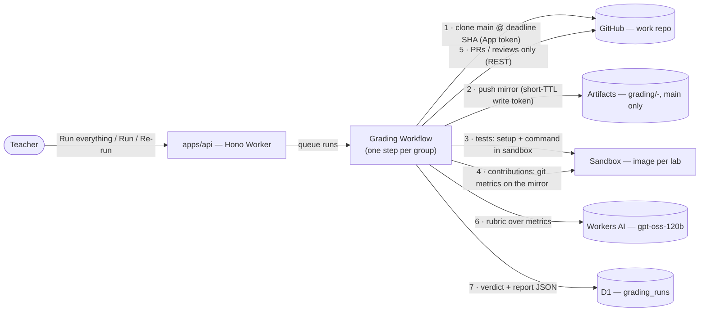

# Autograding — spec

_Approved brainstorm: `2026-08-17-autograding.brainstorm.md` (decisions 1–12). Mockups: `docs/design/mockups/2026-08-17-lab-grading.mockup.html`, `…-grader-config.mockup.html`, `…-grading-report.mockup.html`. Design language: `docs/design/design-language.md`._

## Problem

Teachers grade lab repos by hand or through GitHub Classroom's autograding, which runs a workflow inside each student's repo (visible, editable by students, push-triggered, results reduced to a passing flag). roster manages the class, labs, groups and work repos, but stops at "last push vs deadline". There is no way to run the lab's tests on every group's `main` at the deadline from one place, nor to see how the work was done over time and between members.

## Goals

- From the lab page, run **graders** on every group's `main` at the deadline and read the results in one table, with the evidence behind each result one click away.
- Two graders now, more later through one plugin contract:
  - **tests** — run the starter code's test command in an isolated sandbox; **passing / total tests** when the runner's summary is readable (`17 / 19`), else **pass / fail**.
  - **contributions** — read the git history and rate four dimensions 0–2 (**n / 8**) with a rationale and evidence.
- Everything is **advisory** and **prof-facing**: manual trigger, no student-visible artefacts, no grade written anywhere.
- Simple: no points to configure, no weights, no totals; the test suite in the starter code is the scale; the tests config lives in the starter code.

## Non-goals

- Grades, late penalties, feedback to students (the app already shows last push vs deadline; grading stays the prof's).
- A test-case editor / input-output cases (Classroom's `autograding-io-grader`). One command only.
- Push-triggered grading; grading branches other than `main`; per-test partial credit (JUnit/TAP parsing) — later, opt-in.
- Anthropic/Claude inference (deferred); anything running in the student's repo (Actions, workflows).

## Design



### Snapshot (decision 2, 5)

A **SHA** is a commit id; the **snapshot** is the repo state graded. Per group, per run: SHA = last student commit on `main` ≤ deadline (bot commits excluded; no override). The core mirrors `main` up to that SHA into an **Artifacts** repo `grading/<lab-slug>-<group-slug>` — clone from GitHub with the App installation token inside a sandbox, push with a per-run short-TTL write token. Re-runs re-push. Every grader reads the mirror; other branches are never graded. Rationale: students keep control of the GitHub repo after the deadline; the mirror is ours, immutable, EU-localizable.

Until Artifacts beta access is granted (account currently gated, request submitted), the mirror step is a no-op behind a flag: the SHA is stored and graders clone from GitHub directly.

### Plugins (decision 3, 11)

`apps/api/src/lib/grading/<kind>/` exports `{ kind, configSchema, run(ctx) → { verdict, report } }`; `lib/grading/index.ts` is the registry (same shape as `lib/reconcile/`). One grader per kind per lab; display order fixed by the registry (tests, contributions). Handlers orchestrate; only `lib/github/`, `lib/llm/`, `lib/sandbox/` touch external services (AGENTS rule 7).

**tests** (decision 10, 12). Config = `roster.yml` at the root of the **starter code**, read from the template repo's `main` at run time (never the student's copy):
```yaml
tests:
  setup: npm install     # optional; cached on lockfile hash
  command: npm run test  # exit 0 = pass
  timeout: 10            # minutes, setup + command
```
Absent → parsed from `.github/workflows/classroom.yml` (`setup-command`, `command`, `timeout`) so existing TWeb templates work unchanged. UI adds only the sandbox **environment** (image). Run: sandbox on the mirror → setup → command → capture exit code, stdout/stderr (tail, capped), durations. **verdict** = `passing / total` when the runner's summary line is readable with a small regex table (mocha, jest/vitest, pytest, node --test, JUnit/Maven — no LLM), else `pass | fail` from the exit code; report = command, exit code, durations, output. So the number of tests in the starter code is the grader's scale, identical for every group; a JUnit XML path can replace the regex later.

**contributions**. Stage 1, deterministic, from the mirror clone (`git log --numstat`, `git shortlog -sne`, `Co-authored-by` trailers; bots excluded): commits & lines per author mapped to group members by GitHub login/email, share of work in the last 24/48 h, 14-day daily buckets, bus factor, merges vs direct pushes, message length stats, message sample. Plus one GitHub call: PRs on `main` and their reviews. Stage 2: `lib/llm/` (Workers AI, `gpt-oss-120b`, structured JSON output) rates each enabled dimension **0–2** with `confidence`, `rationale`, `evidence[]` (SHAs / PR numbers, validated against stage-1 data; unknown pointers dropped and confidence lowered). Dimensions: work spread over time · descriptive commit messages · balanced contribution (groups only) · branches and pull requests (groups only) · DevOps practices (groups only, off by default). Config = dimensions on/off + optional extra guidance; model under Advanced. **verdict** = sum (n / 2×enabled). Model id + prompt version stored on the run.

### Orchestration

Run everything / Run (one grader) / Re-run (one group) → handler inserts `queued` runs → **Cloudflare Workflow**, one step per group (mirror once, then each grader), retries on transient errors → UI polls. Runs never overlap for the same lab; a queued lab shows "running" until done. Stop cancels queued steps.

### UI (decision 9, 11) — see mockups

- Tab strip **Groups | Grading** under `LabHeader` on both teacher pages (`/classes/:classId/labs/:labId/manage/grading`); students redirected as on the groups page.
- `LabStats`: graded / total · all tests passing (groups) · failed runs.
- **Graders**: one card, one row per attached grader (name · summary · last run · Configure · Run). Empty state: "Add tests grader" / "Add contributions grader" (auto-offered when the starter code has `roster.yml` or `classroom.yml`).
- Toolbar: search · `all | failed only` (dims rows) · caption "graded from main at the deadline" · **Run everything**.
- **Score table**: Group · main @ deadline (SHA link) · Tests (`17 / 19` tabular, or pass / fail chip when unparsed; "error" + Hint when setup/command could not run) · Contributions (n / 8; Hint on low confidence) · last run · **Re-run** (always, disabled while running / no repo) · **Report ›**.
- **GraderDialog** (shared shell; plugin body): tests = parsed `roster.yml` block, fallback note, Reload from starter code, Environment, Dry run on a repo, Remove; contributions = dimensions on/off, extra guidance, Advanced › model, Remove.
- **ReportDialog** (plugin sections): header with the two verdicts (tests `17 / 19` or pass/fail, contributions n / 8), Re-run this group; tests = error sentence, exit code / parsed passing / duration, command output, setup log; contributions = metrics strip, authors table with bars, per-dimension score · confidence · rationale · evidence chips. Footer: mirror ref, "scores are advisory; the grade is yours", Copy summary.
- No new tokens or colours: pass = secondary, fail = destructive, queued / running / no repo = outline.

## Data

```
lab_graders    id · lab_id → labs · kind ('tests' | 'contributions') · config JSON · enabled · created/updated
               unique (lab_id, kind)
grading_runs   id · lab_grader_id → lab_graders · group_id → groups · commit_sha · mirror_ref (nullable)
               status queued|running|done|failed · verdict TEXT (plugin scalar: '17/19' | 'pass' | 'fail' | '6') · report JSON
               error · triggered_by → user · started_at · finished_at · created_at
```
`kind` is the plugin axis — a new plugin is a new enum value and folder, no new table. `report` is validated by the plugin's zod schema on write. Large outputs are truncated before storage (tail 64 KB); no R2 in v1. Migrations named per AGENTS (`pnpm --filter @roster/db db:generate --name=grading_tables`), SQL read before apply.

## Failure modes

| What breaks | What the teacher sees |
|---|---|
| Group has no repo / no commit before the deadline | row "no repo" / "no commits", Re-run disabled; not counted as failed |
| Mirror push fails (Artifacts down / not enabled) | run continues from GitHub with the SHA; report notes "not mirrored" |
| `roster.yml` and `classroom.yml` both absent | tests grader cannot be attached; empty state says which file to add |
| Setup or command times out / image lacks the toolchain | verdict `fail` with the sentence naming the step and the timeout; output kept |
| Model unavailable / invalid JSON | run `failed` for contributions only; tests unaffected; Re-run |
| Author email not mapped to a member | listed as "unknown author" in the report, never dropped; balance dimension confidence lowered |
| Two teachers press Run at once | one lab-level lock; second gets "already running" |
| GitHub rate limit on PR listing | PR/branch inputs marked unavailable; those dimensions scored with lower confidence |

## Testing

- Unit: `roster.yml` / `classroom.yml` parsing (both shapes, missing, malformed); SHA resolution (bots, deadline boundary); metrics script on a fixture repo (authors, co-authors, buckets, bus factor); verdict computation; evidence validation drops unknown SHAs.
- Integration (miniflare): plugin registry, run creation → workflow → D1 rows; report zod schemas.
- Live (user-gated, as for every 🔴 task): run both graders on the two `lab-2-primitives-team-alpha*` repos and one TWeb tetris repo; dry run against the TWeb solution must be `pass`.
- Tests written after the visual/live gate, per the team's working mode.

## Open questions

- Sandbox images: which set to maintain first (Node 22 + Python 3.12; Java 21 + Maven; .NET 9?) — owner: user, before phase 3.
- Artifacts beta: submit the request (owner: user); until then the flagged no-mirror path is what runs.
- Should the tests grader attach itself automatically when the starter code has a `roster.yml`? Leaning yes (one click less); decide at the empty-state review.
